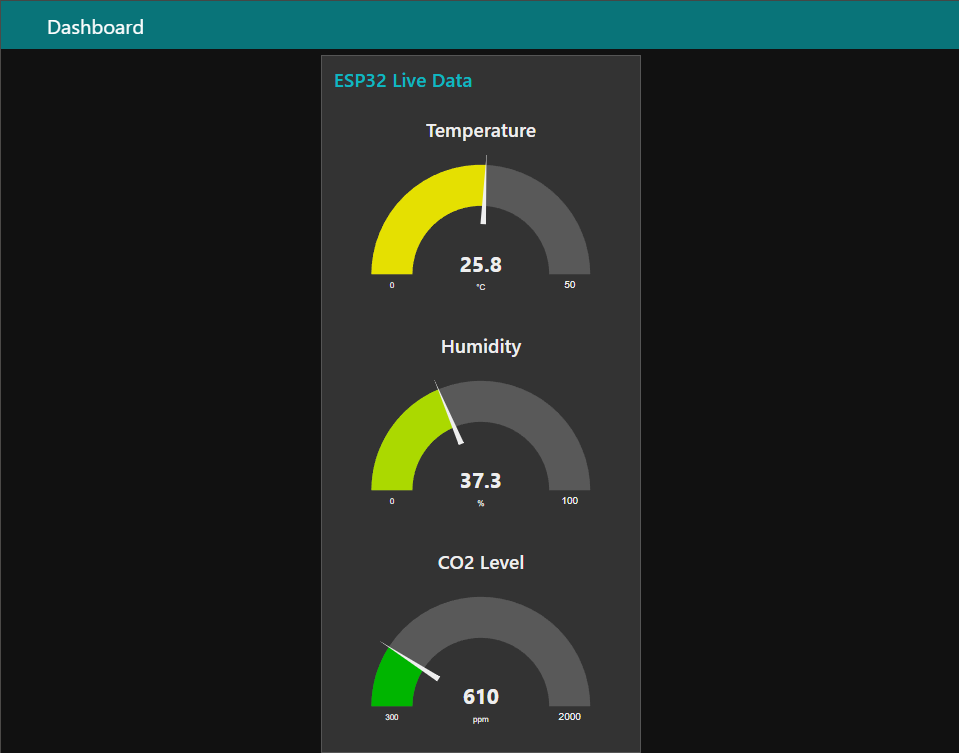

# 🌍 ESP32 Air Quality Monitor (Inov8 UMFST)

### 🚀 Quick Summary
IoT system built for the **Inov8 UMFST** competition that monitors indoor air quality. It sends data from an **ESP32** to a **Node-RED** dashboard via **MQTT**.

### 🛠️ Hardware & Tech
* **Microcontroller:** ESP32
* **Sensors:** BME280 (Temperature/Humidity Sensor) & MH-Z19E (CO2 Sensor)
* **Protocol:** MQTT (HiveMQ) + JSON
* **Dashboard:** Node-RED

### 📂 How to use
1.  **Firmware:** Flash the `.ino` file from `/firmware` to your ESP32.
2.  **Dashboard:** Import `node-red/flow.json` into your Node-RED instance.
3.  **Config:** Update WiFi credentials in the code.
